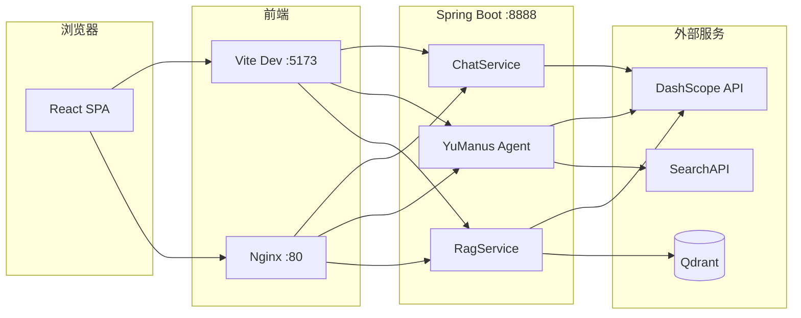

# Chun AI

基于 **Spring Boot 3**、**Spring AI Alibaba（通义 DashScope）** 与 **React** 的全栈 AI 应用，提供三种能力：

| 模式 | 说明 |
|------|------|
| **对话** | 纯大模型聊天，支持多轮记忆与 SSE 流式输出 |
| **AI 智能助手（Agent）** | ReAct 式智能体，可自主规划并调用联网搜索、终端命令等工具 |
| **知识库（RAG）** | 上传 Markdown 文档，经 Qdrant 向量检索后由大模型作答 |

## 技术栈

| 层级 | 技术 |
|------|------|
| 后端 | Java 21、Spring Boot 3.5、Spring AI 1.1、Spring AI Alibaba DashScope |
| 向量库 | Qdrant（gRPC `6334`，集合 `chun_ai`） |
| 前端 | React 18、Vite 6、TypeScript、Tailwind CSS v4 |
| 部署 | Docker Compose（Qdrant + 后端 + Nginx 前端） |

## 架构概览



## 目录结构

```
chun-ai/
├── src/main/java/com/hjc/chunai/
│   ├── controller/          # REST / SSE 接口
│   ├── service/             # 普通对话 ChatService
│   ├── agent/               # ReAct / ToolCall / YuManus 智能体
│   ├── rag/                 # RAG 服务与文档加载
│   ├── tools/               # Agent 工具（搜索、终端、终止）
│   └── config/              # CORS、工具 Bean 等
├── src/main/resources/
│   ├── application.yml      # 应用与 AI 配置
│   └── md/                    # 启动时默认加载的示例文档
├── front/                     # React 前端
├── docker-compose.yml
├── Dockerfile                 # 后端镜像
└── docs/
    └── API.md                 # 接口说明
```

## 环境要求

- **JDK 21**
- **Maven 3.9+**（或使用项目自带 `./mvnw`）
- **Node.js 18+**（仅本地开发前端时需要）
- **Docker & Docker Compose**（一键部署时需要）

## 配置说明

仓库中 **不包含真实 API Key**。`application.yml` 仅引用环境变量；模板与本地覆盖文件如下：

| 文件 | 说明 |
|------|------|
| `src/main/resources/application.yml` | 已提交，密钥使用 `${ENV}` 占位 |
| `src/main/resources/application.yml.example` | 完整配置模板（含注释） |
| `src/main/resources/application-local.yml.example` | 本地私密配置模板 |
| `src/main/resources/application-local.yml` | **已 gitignore**，复制 example 后填入密钥 |
| `.env.example` | Docker Compose 用环境变量模板 |
| `.env` | **已 gitignore**，`cp .env.example .env` 后填写 |

### 方式 A：环境变量（推荐）

| 环境变量 | 对应配置 |
|----------|----------|
| `SPRING_AI_DASHSCOPE_API_KEY` | DashScope API Key |
| `SEARCH_API_API_KEY` | SearchAPI（Agent 联网搜索） |
| `SPRING_AI_VECTORSTORE_QDRANT_HOST` | Qdrant 主机（默认 `localhost`） |
| `SPRING_AI_VECTORSTORE_QDRANT_PORT` | Qdrant gRPC 端口（默认 `6334`） |

### 方式 B：本地配置文件

```bash
cp src/main/resources/application-local.yml.example src/main/resources/application-local.yml
# 编辑 application-local.yml，填入密钥

export SPRING_PROFILES_ACTIVE=local
./mvnw spring-boot:run
```

> **若密钥曾提交过 Git**：请在 [DashScope](https://dashscope.console.aliyun.com/) 与 [SearchAPI](https://www.searchapi.io/) 控制台**立即轮换**，旧 Key 视为已泄露。

本地开发时 Qdrant 需单独启动（见下方「快速开始」）。Docker Compose 会通过 `.env` 注入密钥，并将 Qdrant `host` 设为服务名 `qdrant`。

## 快速开始

### 方式一：Docker Compose（推荐）

```bash
# 在项目根目录
cp .env.example .env
# 编辑 .env，填入 SPRING_AI_DASHSCOPE_API_KEY、SEARCH_API_API_KEY

docker compose up -d --build
```

| 服务 | 地址 |
|------|------|
| 前端 | http://localhost |
| 后端 API | http://localhost:8888 |
| Qdrant | localhost:6334（gRPC） |

### 方式二：本地开发

**1. 启动 Qdrant**

```bash
docker run -d --name qdrant -p 6334:6334 \
  -v qdrant_data:/qdrant/storage qdrant/qdrant:latest
```

**2. 启动后端**

任选其一：

```bash
# 环境变量
export SPRING_AI_DASHSCOPE_API_KEY=你的_dashscope_key
export SEARCH_API_API_KEY=你的_searchapi_key
./mvnw spring-boot:run
```

```bash
# 或本地配置文件（见上方「配置说明」方式 B）
export SPRING_PROFILES_ACTIVE=local
./mvnw spring-boot:run
```

后端默认监听 **http://localhost:8888**。

**3. 启动前端**

```bash
cd front
npm install
npm run dev
```

浏览器打开 **http://localhost:5173**。Vite 已将 `/ai`、`/rag` 代理到 `8888`，无需额外处理 CORS。

## Agent 工具

`YuManus` 智能体在 `ToolConfig` 中注册以下工具：

| 工具 | 作用 |
|------|------|
| `WebSearchTool` | 通过 SearchAPI 调用百度搜索引擎 |
| `TerminalOperationTool` | 在服务器上执行终端命令（**有安全风险，仅应在受信环境使用**） |
| `TerminateTool` | 结束 Agent 多步循环 |

默认系统提示按 **Linux/Bash** 编写；若在 Windows 部署，需在 `YuManus` 中切换为 Windows 版 `SYSTEM_PROMPT`。

## 知识库（RAG）

- 仅支持 **Markdown**（`.md`）上传。
- 文档按 `metadata.source`（文件名）区分；同名上传会先删除旧向量再写入。
- 启动时会将 `classpath:md/1.md` 幂等写入向量库作为示例。
- 相似度检索默认 `topK=5`、`similarityThreshold=0.35`（针对中文短问句调优）。

前端「知识库」页支持：上传、列表、问答、检索预览、按文档删除。

## API 文档

完整请求参数与示例见 [docs/API.md](./docs/API.md)。

## 构建

**后端 JAR**

```bash
./mvnw package -DskipTests
java -jar target/chun-ai-0.0.1-SNAPSHOT.jar
```

**前端静态资源**

```bash
cd front && npm run build
# 产物在 front/dist/
```

生产镜像中前端由 Nginx 托管，并将 `/ai/`、`/rag/` 反向代理到后端容器。

## 测试

```bash
./mvnw test
```

## 安全提示

1. **切勿**将 DashScope、SearchAPI 等密钥写入版本库；使用环境变量或密钥管理服务。
2. Agent 的 **终端工具**可在服务器上执行任意命令，生产环境请禁用或严格沙箱化。
3. RAG 的 `source` 过滤使用字符串拼接，上传文件名应避免包含未转义的单引号。

## 许可证

本项目为个人学习/演示用途，使用前请遵守阿里云 DashScope、SearchAPI 等平台的服务条款。
